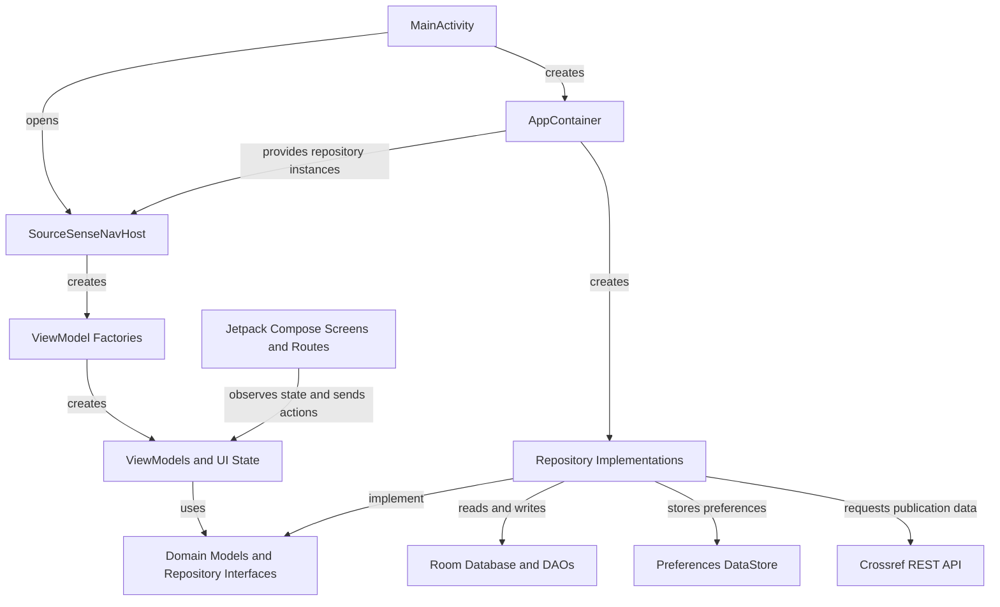

<div align="center">

# SourceSense

### Learn to question evidence, not just collect it.

SourceSense is an Android educational app that helps university students build practical academic source-evaluation skills through guided learning modules, immediate feedback, progress tracking, and structured reviews of real publications from Crossref.


**Developed by Youyang Zhao for CP3406 Mobile Computing**

</div>

---

## Table of Contents

- [Overview](#overview)
- [Acknowledgements](#acknowledgements)
- [Core Features](#core-features)
- [Learning Content](#learning-content)
- [App Workflow](#app-workflow)
- [Screenshots](#screenshots)
- [Architecture](#architecture)
- [Technology Stack](#technology-stack)
- [Responsible and Ethical Design](#responsible-and-ethical-design)
- [Project Structure](#project-structure)
- [Getting Started](#getting-started)
- [Automated Testing](#automated-testing)
- [Future Development](#future-development)
- [Author](#author)

---

## Overview

Students can often find academic material but still struggle to decide whether a source is relevant, credible, methodologically appropriate, or strong enough to support a claim. SourceSense addresses this problem through a guided learning process rather than a simple right-or-wrong quiz.

The app combines two forms of practice:

1. **Structured learning modules** using fictional educational cases with multiple-choice questions, immediate explanations, and learning tips.
2. **Real-source evaluation** using publication metadata retrieved from the Crossref REST API.

SourceSense is designed to help students understand *why* evidence is strong or weak, apply those skills to real publications, and monitor their progress over time.

---

## Acknowledgements

Publication metadata is retrieved from the [Crossref REST API](https://api.crossref.org/). Source availability, publisher pages, and full-text access depend on the information and permissions supplied by the relevant publishers.

Android development uses Jetpack Compose, Material 3, Room, DataStore, Retrofit, OkHttp, Navigation Compose, AndroidX Browser, JUnit, Espresso, and Compose UI Test.

---

## Core Features

### Home and Learning Modules

- Beginner, Intermediate, and Advanced difficulty levels.
- Five topic-based modules at each level.
- Visible module progress, attempt count, and best result.
- Clear learning focus and module description before starting.
- Difficulty selection is saved between app sessions.

### Guided Evidence Evaluation

- Evidence cases with a research question, source details, method, sample, and excerpt.
- Multiple-choice questions linked to specific evidence-evaluation skills.
- Answers are checked before the student moves forward.
- Immediate correct/incorrect feedback.
- Explanations, key points, and learning tips after every answer.
- Final score and question-by-question review.
- Completed attempts are saved automatically.

### Explore Real Academic Sources

- Search Crossref by topic, article title, or DOI.
- View title, authors, publication year, journal, source type, and DOI.
- Open the official publication page in an Android Custom Tab.
- Open full text or a PDF when a usable link is available.
- Clear loading, empty-result, connection-error, and retry states.
- No API key is required.

### Structured Source Review

Students can evaluate a real source using:

- Relevance to the search topic.
- Completeness of publication information.
- Currency of the source.
- Review depth: metadata, abstract, or full text.
- A current citation decision.
- A checklist of items that still need verification.
- An optional reflection note.
- Saved reviews that remain available in the Explore page.

### Learning Statistics

- Overall completed evaluations.
- Average and best scores.
- Progress by Beginner, Intermediate, and Advanced level.
- Skill accuracy by evidence-evaluation dimension.
- Skill status: Strong, Developing, Needs Practice, or Not Enough Data.
- Recommended next focus based on the lowest reliable skill score.
- Total completed structured source reviews.
- Recent evaluation and source-review activity.

### Settings and User Control

- Change learning difficulty.
- Enable larger text.
- Reduce screen animations.
- Enable or disable sound feedback.
- Choose which sections appear in Statistics.
- Restore default settings.
- Clear evaluation history, source reviews, or all learning data separately.

---

## Learning Content

SourceSense contains **15 learning modules** across three difficulty levels.

| Level | Module | Learning purpose |
|---|---|---|
| Beginner | Relevance | Decide whether a source directly addresses a research question. |
| Beginner | Source Type | Identify academic articles, news reports, blogs, and commercial webpages. |
| Beginner | Basic Credibility | Check authorship, publication quality, and evidence transparency. |
| Beginner | Correlation vs Causation | Distinguish an observed relationship from a proven causal effect. |
| Beginner | Claims and Citations | Identify overclaiming and decide whether a source supports a statement. |
| Intermediate | Research Method | Judge whether a study design is suitable for the research question. |
| Intermediate | Sample Quality | Evaluate sample selection, representativeness, and selection bias. |
| Intermediate | Generalisability | Decide how far findings can reasonably be applied. |
| Intermediate | Evidence Strength | Compare evidence using study design, consistency, and methodological quality. |
| Intermediate | Bias and Conflicts | Identify possible bias, funding influence, and conflicts of interest. |
| Advanced | Confounding Variables | Identify third variables that may create a misleading causal relationship. |
| Advanced | Statistical Interpretation | Separate statistical significance from effect size and practical importance. |
| Advanced | Comparing Conflicting Sources | Examine why credible studies may reach different conclusions. |
| Advanced | Systematic Review Quality | Evaluate search coverage, selection rules, and review transparency. |
| Advanced | Research Ethics and Transparency | Evaluate consent, privacy, participant risk, and transparent research practice. |

All learning cases are fictional and created for educational use.

---

## App Workflow

```text
Choose a difficulty level
        ↓
Select a topic-based learning module
        ↓
Read the evidence case and answer questions
        ↓
Receive immediate feedback and learning tips
        ↓
Review the final result and saved progress
        ↓
Search Crossref for a real academic source
        ↓
Read the official source or available full text
        ↓
Complete and save a structured source review
        ↓
Use Statistics to identify the next skill to practise
```

---

## Screenshots

The following screenshots show the main pages and learning flow of SourceSense.

<table>
  <tr>
    <td align="center">
      <strong>Home and Learning Modules</strong><br>
      
    </td>
    <td align="center">
      <strong>Evidence Evaluation</strong><br>
      
    </td>
  </tr>

  <tr>
    <td align="center">
      <strong>Answer Feedback</strong><br>
      
    </td>
    <td align="center">
      <strong>Evaluation Result</strong><br>
      
    </td>
  </tr>

  <tr>
    <td align="center">
      <strong>Learning Statistics</strong><br>
      
    </td>
    <td align="center">
      <strong>Settings</strong><br>
      
    </td>
  </tr>

  <tr>
    <td align="center" colspan="2">
      <strong>Explore Academic Sources</strong><br>
      
    </td>
  </tr>
</table>

---

## Architecture

SourceSense uses an **MVVM-style layered architecture** with repository interfaces and manual dependency injection.



### Main layers

- **UI layer:** Compose screens, routes, UI states, and ViewModels.
- **Domain layer:** App models and repository contracts.
- **Data layer:** Crossref networking, Room entities and DAOs, DataStore preferences, mappers, and repository implementations.
- **Dependency injection:** `AppContainer` creates and shares repository dependencies across the app.

This separation keeps screen code focused on presentation while networking, storage, and business logic remain testable outside the UI.

---

## Technology Stack

| Area | Technology |
|---|---|
| Language | Kotlin 2.2.10 |
| UI | Jetpack Compose with Material 3 |
| Architecture | MVVM-style layered architecture |
| State | ViewModel, StateFlow, Flow, lifecycle-aware state collection |
| Navigation | Navigation Compose 2.9.8 |
| Networking | Retrofit 3.0.0, Gson Converter, OkHttp 4.12.0 |
| External data | Crossref REST API |
| Local database | Room 2.8.4 |
| Preferences | DataStore Preferences 1.2.1 |
| Browser integration | AndroidX Browser Custom Tabs |
| Dependency injection | Manual `AppContainer` |
| Unit testing | JUnit 4 and Kotlin Coroutines Test |
| UI testing | Compose UI Test, AndroidX JUnit, and Espresso |
| Build system | Gradle 9.4.1 with Android Gradle Plugin 9.2.1 |

---

## Responsible and Ethical Design

SourceSense was designed around the ethical issues examined in Assessment 2 and the Australian Computer Society Code of Ethics.

### Honest Use of Academic Metadata

Crossref provides publication metadata, not a final judgement of research quality. SourceSense therefore does not automatically label a paper as reliable or suitable. Students are asked to examine relevance, methods, samples, findings, limitations, and other details themselves.

### Data Minimization and User Control

- The app does not require account registration.
- It does not request access to location, contacts, camera, microphone, or device files.
- Only Internet and network-state permissions are used for online source searching and publication links.
- Evaluation history, source reviews, and preferences are managed through Room and DataStore.
- Users can clear different categories of saved learning data from Settings.

### Accessibility

- Larger-text support.
- Reduced-animation option.
- Optional sound feedback.
- Correct and incorrect answers are communicated with text and explanations, not color alone.
- Loading, empty, error, and retry states provide clear feedback when an action cannot be completed.

### Educational Transparency

- The local module catalogue uses fictional practice cases created for educational use.
- The Explore page explains that Crossref metadata alone does not prove study quality.
- Real-source review decisions remain the student's responsibility.

---

## Project Structure

```text
SourceSense/
├── app/
│   └── src/
│       ├── main/
│       │   ├── java/com/youyangzhao/sourcesense/
│       │   │   ├── data/
│       │   │   │   ├── local/          # Room database, DAOs, entities, DataStore
│       │   │   │   ├── mapper/         # Data-to-domain mappings
│       │   │   │   ├── remote/         # Crossref API service and DTOs
│       │   │   │   └── repository/     # Repository implementations
│       │   │   ├── di/                 # AppContainer dependency provider
│       │   │   ├── domain/
│       │   │   │   ├── model/          # Core app models
│       │   │   │   └── repository/     # Repository interfaces
│       │   │   ├── navigation/         # Routes and Compose navigation
│       │   │   ├── ui/
│       │   │   │   ├── evaluation/
│       │   │   │   ├── explore/
│       │   │   │   ├── landing/
│       │   │   │   ├── result/
│       │   │   │   ├── review/
│       │   │   │   ├── settings/
│       │   │   │   ├── statistics/
│       │   │   │   └── theme/
│       │   │   └── MainActivity.kt
│       │   └── res/
│       ├── test/                         # JVM unit tests
│       └── androidTest/                  # Instrumented Compose UI tests
├── docs/screenshots/                     # README screenshots
├── gradle/
├── build.gradle.kts
├── settings.gradle.kts
└── README.md
```

---

## Getting Started

### Requirements

- Android Studio compatible with Android Gradle Plugin 9.2.1.
- Android SDK 37.1 installed for compilation.
- An emulator or physical Android device running API 24 or later.
- Internet access for dependency download and Crossref features.

### Run the Project

1. Clone or download this repository.
2. Open the `SourceSense` project folder in Android Studio.
3. Allow Gradle to synchronize and download dependencies.
4. Select an emulator or physical device with API 24 or later.
5. Run the `app` configuration.

The Crossref API does **not** require an API key, so no secret or local configuration file is needed.

---

## Automated Testing

The project contains **46 automated tests**:

- **37 JVM unit tests**
- **9 instrumented Compose UI tests**

| Test area | Main behavior covered |
|---|---|
| Evaluation result calculation | Full, partial, and incomplete answers |
| Evaluation ViewModel | Module loading, answer submission, navigation, completion, save, retry, and restart |
| Landing UI state and ViewModel | Module progress, difficulty changes, completed modules, and history updates |
| Explore ViewModel | Search validation, successful results, connection errors, retry, clearing, and saved reviews |
| Real-source review ViewModel | Source loading, form validation, saving, retry, and saved-state behavior |
| Statistics ViewModel | Statistics observation, recommendations, history clearing, and error handling |
| Evaluation UI | Disabled submission, feedback, next action, and final result behavior |
| Landing UI | Progress display and selected module callbacks |
| Real-source review UI | Complete, incomplete, missing-source, and saved-review states |

The tests use repository fakes and coroutine test utilities so core behavior can be checked without depending on the live Crossref service.

---

## Future Development

Possible future improvements include:

- A side-by-side comparison tool for two or three academic sources.
- A larger question bank with more varied cases.
- Adaptive practice based on skills a student frequently answers incorrectly.
- Student usability testing to improve difficulty, explanations, and the overall learning flow.
- Additional filters for source type, publication year, and research topic.

---

## Author

**Youyang Zhao**  
James Cook University Singapore  
CP3406 Mobile Computing

---

